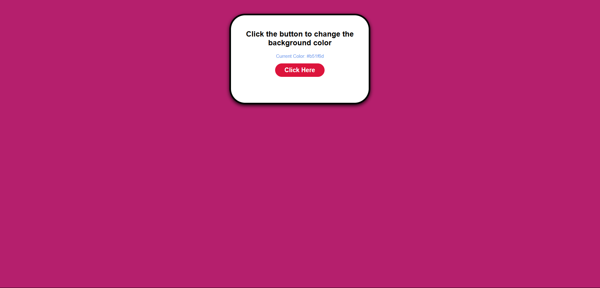
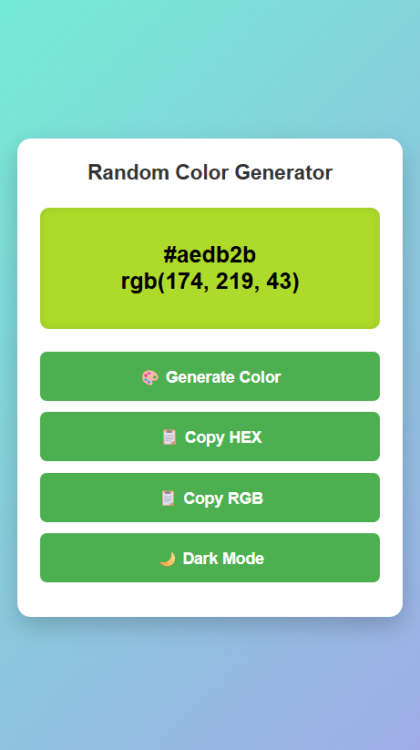

# 🎨 Random Color Generator

## 📌 Description
A simple and interactive web application that generates random colors, displays them in both **HEX** and **RGB** formats, lets you **copy color codes**, and has a **dark mode toggle**. The app is fully responsive and works on all screen sizes.

---

## 🚀 Live Demo
[View Live Project](https://suru190.github.io/Random-Color-Generator/)

---

## 📸 Screenshots

### 💻 Desktop View


### 📱 Mobile View


---

## ✅ Features
- Generate random colors with one click.
- Display **HEX** and **RGB** color codes.
- Copy HEX or RGB code to the clipboard.
- Dark mode toggle for better user experience.
- Fully responsive design.

---

## 🛠️ Technologies Used
- **HTML5**
- **CSS3**
- **JavaScript (ES6)**

---

## 📚 What I Learned
- How to generate random HEX and RGB values using JavaScript.
- How to manipulate DOM elements dynamically.
- Clipboard API usage (`navigator.clipboard.writeText()`).
- How to implement dark mode using `classList.toggle()`.
- Responsive design techniques using media queries.

---

### 📂 Project Structure  

```
Random-Color-Generator/
│── index.html
│── style.css
│── script.js
│── desktop-view.png
└── README.md
```
