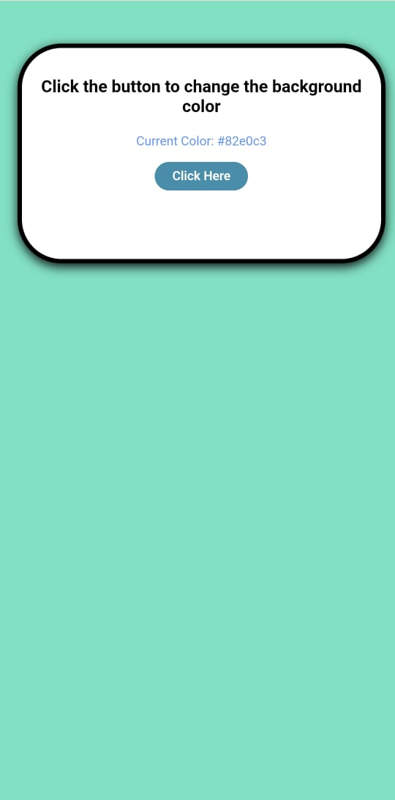

# 🎨 Background Color Changer

This is a simple and fun web project that changes the webpage background colour every time you click a button. It's a beginner-friendly project created to practice basic JavaScript DOM manipulation and event handling.

## 🚀 Live Demo

🔗 [Click here to view the live site](https://suru190.github.io/BG-Color-Changer/)

## 📸 Screenshots

### 🖥️ Desktop View

### 📱 Mobile View

## 🛠️ Features

- Random background color change
- Smooth transition effect
- Displays the current color code
- Responsive design for mobile and desktop

## 🧑‍💻 Technologies Used

- HTML5
- CSS3
- JavaScript

## ✅ What I Learned

- DOM selection with `getElementById`
- Generating random colors using `Math.random`
- Adding event listeners in JavaScript
- Applying styles dynamically with `style` property
- Making a simple layout responsive with media-friendly CSS

## 🔮 Future Improvements

- Add a copy button to copy the color code
- Include multiple color modes (e.g., light, dark, pastel)
